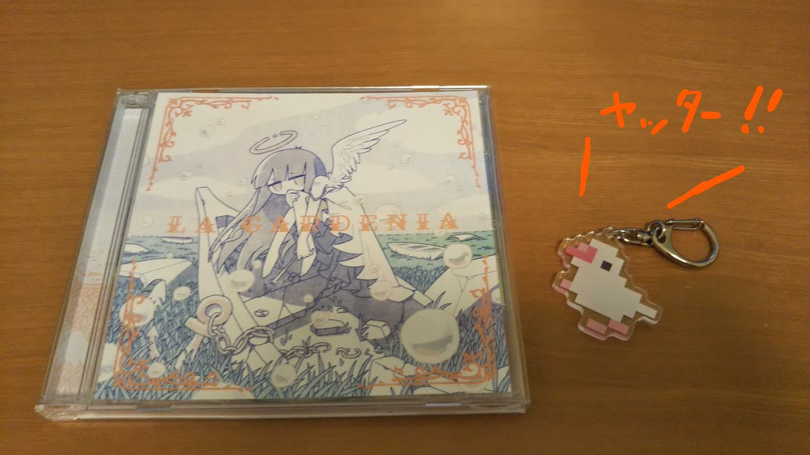

- uynetさんの新作がリリースされたので、わーM3行きてえ〜(田舎民定期)をしていたら、なんとboothで現物CDが売られるそうで、即購入を完了...
- 以下、個人的な感想です。

## # link
- [soundcloud - uynet/LA GARDENIA](https://soundcloud.com/uynet/la-gardenia)
- [Twitter - uynet さん](https://twitter.com/uynet)
- [web - lagardenia.uynet.work](https://lagardenia.uynet.work/)
- [booth - 物理CD](https://uynet.booth.pm/items/2921546)

## # 物理CD、よい...

- ジャケットは [やいぎ](https://twitter.com/_yaigi) さんが手がけています。やいぎさんは WEB展示 よるの火葬 という面白い作品を最近出していて、[OWARINO.xyz](https://owarino.xyz/)から見に行くことができます。個人的に動画の [よるの火葬に行ってみた](https://youtu.be/kW3iZJQyTqI) の雰囲気が楽しいのでこちらもぜひ。これは過去に行われた個展の様子で、GAME BOYとかが出てきて面白かったです。
- 表の絵、神秘的でなんか意味ありそうとしばらく考えていましたが何も浮かびませんでした(完) これは楽園をイメージしているので羽が生えているのはおそらく天使なんですが、どうもその天使の乗っていた船は壊れていて、草木も生い茂っているので風化してそうな感じがあります。腕にはなにやら個体識別バーコードみたいなものがあるし不穏な感じがあります。でもタイトルのフォント、装飾、うかぶシャボン玉的なやつは楽園にふさわしいメルヘンさを持っているので...うーん分からん！投了！
- デザイン周りはフォントとか花文字っぽく凝っていて、Webの方とも統一されて世界観があって好きです。よさみ。

## # 聴いた
## ## ミルキーホワイト
- Vocal 初音ミク 使っているのびっくりしました。個人的にuynetさんは音ゲー曲っぽいテンポ爆速イメージが強かったので、どうなるんじゃと思っていたら普通に初音ミクがいい感じに溶け込んでいた。リズム感がライブで流れてそうな感じで、会場が温まってきたところでDJが掛けてそう。よい。

## ## Utopia Garden
- これLA GARDENIAに近いタイトルなので身構えていた。(アルバムSTELLAでは1曲目でこう盛り上がってきて世界観をインストールしてからの2曲目のprominenceで激しく最高になってしまったので)
- めっちゃuynetさんという感じがする。前半がめちゃくちゃきれいでアドベンチャー系のゲームで3Dのきらきらの水面まで見えた(？)これ好き。

## ## Noname History
- 前曲がいい感じのフェードアウトをしていって、ほお〜となっていたところでこの曲のイントロだけで撃ち抜かれてしまった。僕はNoname Historyがダントツで一番好きです。
- やっぱuynetさん独自のよさがあるよな〜〜〜！！曲は世の中に大量にあって日々spotifyなりyoutubeなりsoundcloudなりで大量に曲を聴いて自分の好きな曲に巡り合っているけどこれはマジで初めてのタイプすぎては〜〜〜！！！後半畳み掛けてくるのずるいだろ〜〜〜！！！最後の静かになるパートとかううう...
- これ最高

## ## 此岸ノ華
- 日本っぽい音〜と思ったらタイトルもそんな感じで納得した。
- 個人的にuynetさんの曲は音が複雑に大量に出てきてパァーッと開ける感じが好きなんですが、その影響で、こう静かになる瞬間がグッと来ますね。というかバキューンみたいな音鳴らなかったか？違和感なくて草。これもすき。

## ## Astral Heaven
- とてもかわいい。astralだから⭐という感じでポップで、前の曲で重厚な感じからの軽快さで気持ちええ。
- こうして見るとアルバムって順番大事なんですね。ストリーミング系だと自分でプレイリスト作っちゃうから分からなくなっている最高さみたいなのもあるんだろうなあ。
- これはノリノリで聴けて、最後までポップな感じを貫いていて好き。踊りながら聴きたい。

## ## Ever Rezort
- Rezortってどういう意図でzなんだろうと思ったんですがわかりませんでした。
- ポップな感じを引き継いでピアノもきれいだし軽快でアルバムSTELLAのような宇宙感がありつつも、随所に楽園！って感じの音があってよさみが深い。

## ## Farewell
- farewell partyとかのfarewellかと思ったら、どちらかというと卒業式ソングみたいな雰囲気でピアノの雰囲気がめっちゃ高校の卒業式感ある。いやこんな最高のピアノ曲高校で流れてきたら卒業どころではなくなるけどな！
- 楽園との別れという意味なのでしょうか？それならば一曲終えて天界と別れてきた状態がアルバムジャケットの天使に対応するんだろうか...？色々考えてみましたがミルキーホワイトの歌詞からして楽園は天使がいる場所自体を指していて、うーん、何と何の別れなんだろうか。現代文をまともに勉強してこなかったのが悔やまれます。
- これしんみりしすぎなくて軽快さがあって、よきですね...

## # 終わりに
- 個人的にNoname Historyはめちゃくちゃ収穫すぎてTwitterやっててよかったなと思った。感謝。
