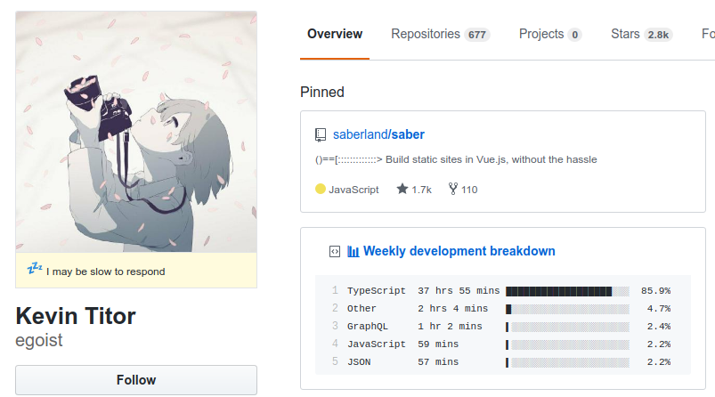
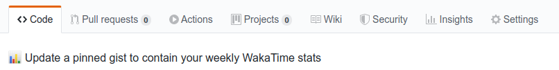
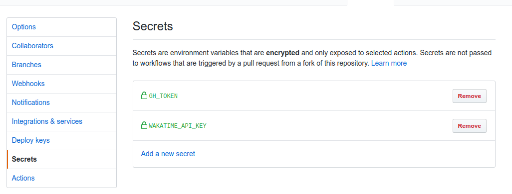
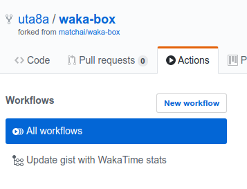
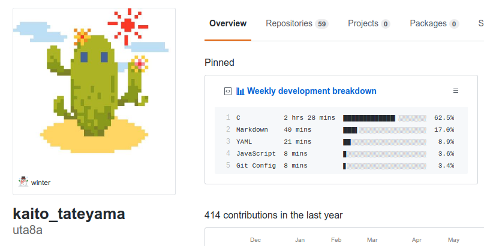

---  
date: "2019-12-02T04:38:30+09:00"  
title: "waka-boxを使ってみる 広島大学ITエンジニアアドベントカレンダー"  
type: "post"  
draft: false  
---  
  
この記事は [広島大学ITエンジニアアドベントカレンダー] の4日目です。  
僕はOSS界隈で活躍している人のGitHubを見るのが好きです。contributionの数も、有名なOSSへ送ったissueやpull requestの数も僕とは桁違いで、こうなれたらなあと思います。また、そういった方々は中規模のプロジェクトを作っていることが多いので、プロジェクトのディレクトリ構成とか、どのツールを使っているのか？といった状況を学べます。また、コードを書いて生活する人にとって、GitHubは仕事場のひとつのようなものだと思います。その人の仕事場へのこだわりのようなものをpinnedやprofile, 所属団体から感じるのは楽しいことで、眺めるだけで時間があっという間に過ぎていきます。  
さて、そんな感じでフロントエンド周りの方々を調べていると ([egoistさん]) のpinnedに不思議なものを見つけました。  
  
  
  
(写真は2019-12-02時点のもの)  
Weekly development breakdownという項目で、どうやら1週間に書いたコードの時間となんの言語で書いたかが示されているようです。  
僕もこれやってみたい！というわけで、この記事では、この表をpinnedに表示することを目標としてやっていきましょう。  
  
# 仕組み  
この表は [waka-box] を使っています。自分のエディタにプラグインを入れておくと一週間のうち何時間コードを書いたか、を示してくれる、"WakaTime"というWebサービスがあり、そのAPIを利用して、gistに表を作っています。  
例えば僕の場合、VSCodeにExtensionで [WakaTime] を入れています。APIを利用するためのsecret keyを入れたら後は何もせずコードを書けば大丈夫です。  
  
# [waka-box] の導入  
基本的に [waka-box] のREADMEに従えばできます。自分が詰まったところを捕捉しながら書きます。  
  
## 準備  
1. gistを作る(GitHub) -> gistのURLをメモしておく このときのgistはdescription以外上書きされるので、gistの中身はなんでもよいです。  
2. gistだけにチェックを入れたtokenを発行(GitHub) -> メモしておく  
3. WakaTimeのアカウントを作る(wakatime)  
4. wakatimeのsecret keyを手に入れる -> メモしておく  
今3つメモしたと思います。1のgistのURLは公開してもよく、**2,4は公開してはいけません！**取り扱いに注意しましょう。  
  
## [waka-box] を入れる  
https://github.com/matchai/waka-box を自分のGitHubへとforkします。  
準備で手に入れた3つの値を入れていきます。gistのidは `.github/workflows/schedule.yml` にすでにある値を書き換えます。  
gist tokenとwakatime secret keyは  
  
  
  
Settingsの  
  
  
  
Secretsに書き込みます。2つの値を書き込むと上の図のようになります。  
そして、gistをpinnedに置きます。完成です！  
  
## 動作確認  
### GitHub Actions  
GitHub ActionsでWakaTime APIから情報をとってきてgistに書き込みを行うので、きちんとActionsが動いているか確かめる必要があります。  
  
  
  
上の図のように、Workflowsに表示があればOKです。10分ほど待つと、gistが変化するはずです  
### gistに反映されない！  
APIからデータをとってくるときは**前日から7日間のデータをとってきているようです。**僕の場合は、最初gistに何も書き込まれずファイルが消滅して、次の日00:00以降最初のActionでデータが反映されました。  
  
### Actionが動かない！  
2019/12/20時点では、waka-boxをcloneした後に、`.github/workflows/schedule.yml` を一旦削除し、commitしてgithubへpushした後に再度同じ内容の `.github/workflows/schedule.yml` を作り直さないとActionが動かないようです。  
  
参考(私のcommit logです)  
delete https://github.com/uta8a/waka-box/commit/64e351d872941cca0b92245929e10a5b20fb2f34  
re-add https://github.com/uta8a/waka-box/commit/079eb1d7d425b4f45b5cfc7aca89c6e1ac4e2a66  
  
# 終わりに  
以上です！意外とコードを書いているつもりでも書いていなかったりするので、目安にして精進していきたい...！  
  
  
  
<!-- link -->  
[広島大学ITエンジニアアドベントカレンダー]:https://adventar.org/calendars/4481  
[egoistさん]:https://github.com/egoist  
[WakaTime]:https://wakatime.com/vs-code  
[waka-box]:https://github.com/matchai/waka-box