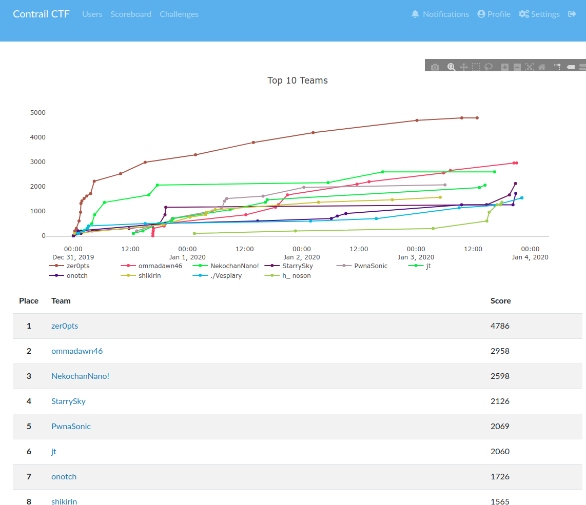

---  
date: "2020-01-04T01:08:12+09:00"  
title: "ContrailCTF Writeup"  
type: "post"  
draft: false  
---  
  
チームStarrySkyは正の点数を得た78チーム中、2126点を獲得して4位でした。うち僕は504点を獲得しました。  
僕が解いたLets_Connct、Persistence、alice's passwordについてのWriteupです。  
  
  
  
# Lets_Connct[misc]  
ncでつなぐよう指示があるのでつなぎ、flagの中身を見ます。  
```  
❯ nc <問題サーバ> 2999  
bash: cannot set terminal process group (-1): Inappropriate ioctl for device  
bash: no job control in this shell  
bash-4.4$ ls  
ls  
bash  
bin  
dev  
flag  
lib  
lib32  
lib64  
bash-4.4$ echo "$(<flag)"  
echo "$(<flag)"  
Flag has moved to 3000 port on 172.17.0.10.  
```  
別の場所にflagが移されたようです。ncでつなごうとしますがncはないと言われてしまいます。  
```  
bash-4.4$ nc 172.17.0.10 3000  
nc 172.17.0.10 3000  
bash: nc: command not found  
```  
そこで、`bash nc alternative`と検索をかけると、以下の記事がヒットします  
https://stackoverflow.com/questions/20661320/alternative-to-cat-out-of-a-bash-script  
https://github.com/solusipse/fiche#useful-aliases  
catがないのでそのまま使うことができません。よく分からないのですが、以下のような手順でflagを得ました。  
```  
bash-4.4$ exec 3<>/dev/tcp/172.17.0.10/3000  
exec 3<>/dev/tcp/172.17.0.10/3000  
bash-4.4$ while read -t 5 line <&3; do  
    echo "$line"  
    (( Lines++ ))  
donewhile read -t 5 line <&3; do  
>     echo "$line"  
>     (( Lines++ ))  
>  
done  
ctrctf{b4sh_1s_a_mul7ifuncti0n_sh3ll}  
```  
flag: `ctrctf{b4sh_1s_a_mul7ifuncti0n_sh3ll}`  
  
# Persistence[forensics]  
forensics_persistence.arnというファイルが渡されます。mitsuさんからAutorunで開けると聞いたのでこれはハッキングラボの作り方という本でやったやつだ！！(進研ゼミ感)でテンションを上げました。VMで動かしているWindows10で[Sysinternals Suite](https://docs.microsoft.com/ja-jp/sysinternals/downloads/sysinternals-suite)をダウンロードして、Autorun64.exeを使っていきます。今回は、素の状態で一度Autorunを動かしorigin.arnを生成してからforensics_persistence.arnと比較を行いました。[こちらの記事](https://www.atmarkit.co.jp/ait/articles/1407/28/news021.html)が参考になります。比較すると緑色のところが差分になるので、そこを見ていくとEvilという項目があり、flagが書いてありました。  
flag: `ctrctf{P3rs1st3nc3_5ch3dul3d_Ta3ks}`  
  
# alice's password[forensics]  
Volatilityの使い方が試されます。そもそもインストールチャレンジで失敗したのでインストール方法を書いておきます。  
https://github.com/volatilityfoundation/volatility にアクセスしてダウンロードします。vol.pyが本体なので、`python path/to/vol.py -f <file> imageinfo`のように使うことができます。mimikatzのような外部プラグインのダウンロードの仕方が分からなかった...(plugins/以下に入れればいけるやろと思ったらうまくいかない)  
`python path/to/vol.py`を`vol`とaliasした状態で以下のようにコマンドを打ちました。参考にしたのは[この記事](https://www.andreafortuna.org/2017/11/15/how-to-retrieve-users-passwords-from-a-windows-memory-dump-using-volatility/)と[公式のWiki](https://github.com/volatilityfoundation/volatility/wiki/Command-Reference)です  
```  
vol -f memdump.mem imageinfo  
vol -f memdump.mem hivelist  
# 0xfffff8a0063fa010 sam  
# 0xfffff8a000024010 system  
#   
vol -f memdump.mem --profile=Win7SP1x64 hashdump -y 0xfffff8a000024010 -s 0xfffff8a0063fa010 > hashes.txt  
```  
これでhashが手に入ります。  
```  
Administrator:500:aad3b435b51404eeaad3b435b51404ee:31d6cfe0d16ae931b73c59d7e0c089c0:::  
Guest:501:aad3b435b51404eeaad3b435b51404ee:31d6cfe0d16ae931b73c59d7e0c089c0:::  
Aqua:1000:aad3b435b51404eeaad3b435b51404ee:813ea107eccdab91a1b9c15b67693cb4:::  
Alice:1001:aad3b435b51404eeaad3b435b51404ee:19bf8c07d19ea196464115e443854654:::  
```  
`19bf8c07d19ea196464115e443854654`を[https://crackstation.net/](https://crackstation.net/)にかけると`i<3orange.`と解読されるので、これのmd5hashがZIPのパスワードになります。(うまくいかなかったので最後のmd5からmitsuさんにやってもらった)  
flag: `ctrctf{Y0u_c4n_dump_4nd_cr4ck_hash!}`  
  
# 解けなかった問題  
# once_again  
# Hacking Battler  
# LegacyBlog  
  
# 終わりに  
毎度思うけど段階が一個しかない簡単なものしか解けてない。2020年は勉強して本質が解けるようになりたいです。あと毎回そうだけど今回もmitsuさんが無双していた。  
Contrailの皆さん、年末年始お疲れさまでした。楽しかったです。