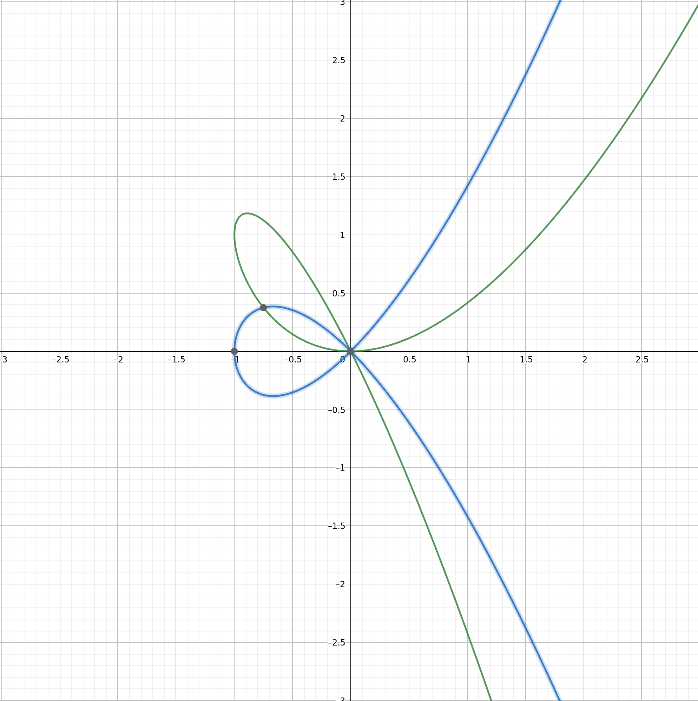

- この記事は[hxp ctf 2020 hyper](https://ctftime.org/task/14387)の writeup を読んで超楕円曲線について学んだ記録です。
- 間違いなどあれば[@kaito_tateyama](https://twitter.com/kaito_tateyama)にお知らせいただけると幸いです。

## # hyper

- 問題概要

## ## 超楕円曲線と楕円曲線の違い

- **def.** 超楕円曲線
- 体$K$上の種数(genus) $g$ の超楕円曲線は以下のように定義される。
- 超楕円曲線とは、代数曲線の中でも特に以下の形式で表されるものを指す。

$$
y^2 + h(x)y = f(x)
$$

- ここで、 $h(x) \in K\[x\]$ , $\deg(h(x)) \leq g$ , $f(x) \in K\[x\]$ , $f(x)$は Monic で , $\deg(f(x)) = 2g + 1$ である。
- 今回の問題を例として見ると、$y^2 = x^7 + x$であり、$\deg(f(x)) = 7 (=2 \times 3+1)$, $\deg(h(x)) = \deg(0) = -\infty < 3$から、$\mathbb{F}_p$上の種数$3$の超楕円曲線であると分かる。

- **def.** 楕円曲線
- 楕円曲線とは、代数曲線の中でも、以下の形式で表されるものを指す。

$$
y^2 = x^3 + ax + b
$$

- ここで、$a,b \in \mathbb{R}$である。

- 違いをまとめると、超楕円曲線は種数の概念を入れて楕円曲線を一般化したものとみなせそう。

- **補足**
- $K\[x\]$は係数が体$K$の要素である多項式$f(x)$の集合を表す。
- $\deg(f(x))$は多項式の最大次数を表す。
- Monic とは、最大次数の係数が$1$であることを表す。

## ## 超楕円曲線の定義の仕方について

- 英語版 wikipedia や、hxp/hyper の writeup をいくつか見て、超楕円曲線の定義の仕方は複数あることが分かった。
- 上の定義とは別の定義では、

$$
y^2 = f(x)
$$

- としている。($f(x)$については上の定義と同じ条件である。)どちらの定義でも hxp/hyper を解く上では問題ない。
- 英語版 wikipedia では$y \rightarrow y - \frac{h(x)}{2}$の変数変換によって 2 つ目の定義と同一視できるとあるが、この変数変換による同一視がなぜ許されるのか納得できなかった。
- 例えば、$y^2 + 2xy = x^3$はこの変数変換によって$y^2 = x^3 + x^2$に移り、この 2 つの楕円曲線を描いてみると以下のようになる。(緑が前者、青が後者)



- 形はだいたい一緒な気がするが、例えば$y \rightarrow y^2$のような変換は超楕円曲線ではなくなってしまうし、この変換で何を同一視しているのかは分からなかった。

```
https://en.wikipedia.org/wiki/Hyperelliptic_curve
https://neuromancer.sk/article/25
https://mystiz.hk/posts/2020-12-20-hxpctf-hyper/
https://homes.esat.kuleuven.be/~fvercaut/papers/cc03.pdf
https://www.iisec.ac.jp/proc/vol0002/iisec_proc_002_p043.pdf
https://pwnthem0le.polito.it/2020/12/20/hxpCTF-2020-Hyper-writeup/
https://mattyuu.hatenadiary.com/entry/2017/01/29/161758
https://www.josephsurin.me/posts/2020-12-21-hxp-ctf-2020-hyper-writeup

```