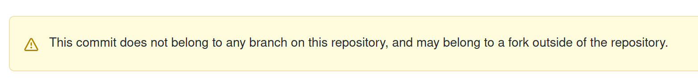
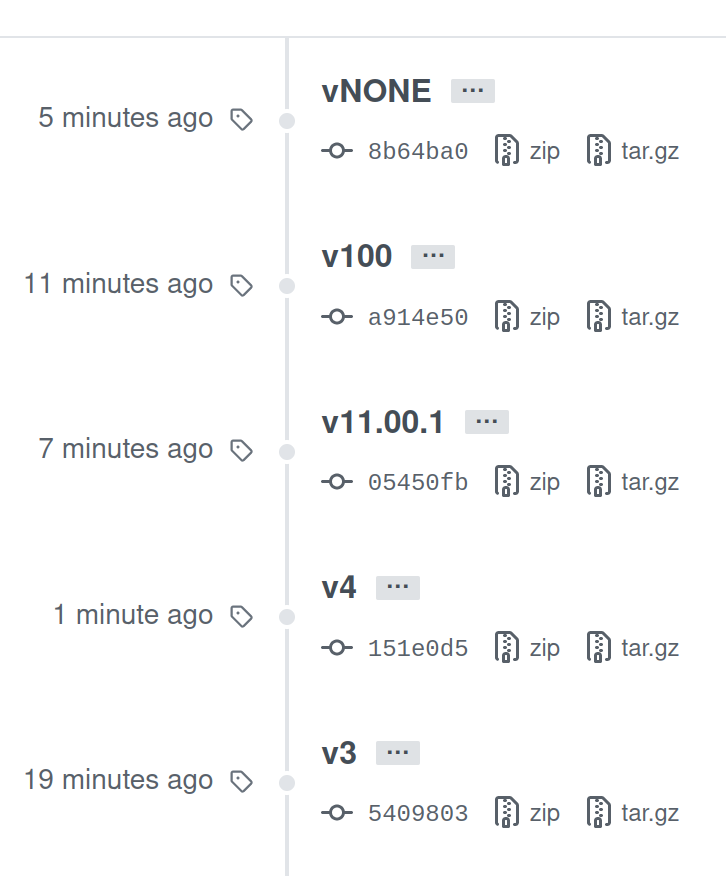

人のコードを読んでいいところを学んでいこうと思います。traPのtraQ, NeoShowcase, camphor-のrelaymあたりは読んでいきたいです。
今回は、色々見て回って[mazrean/separated-webshell](https://github.com/mazrean/separated-webshell)がよさそうだと感じたので読みます。

# # 前提条件
- repository: [https://github.com/mazrean/separated-webshell](https://github.com/mazrean/separated-webshell)
- 2021/05/26時点での`main`ブランチの最新を対象とします。(commit hash: `5c3e14c32cc5582e9768467f02d22217ac1b6759`)
- ソースコードの解説というより、僕が知らなかったことを解説するみたいな方針でブログに残します(ソースコードの解説は製作者にしかできないので)

# # コードを読む
## ## 概要
おそらく、[CPCTFを支えたインフラ](https://trap.jp/post/1303/)で紹介されている、Webshellの中で動いているssh-separatorがこれに当たると思われます。CTFで使うために、SSHした先を各コンテナに振り分けているようです。
記事では、

> また、日付は決まっていませんがWebshellについてのブログ記事も出る予定なのでお楽しみに！

とあるので、traPブログで解説が出るのを楽しみにしています。

## ## CI/CD
GitHub Actionsを使用していて、Lintを走らせて報告させる`main.yml`, tagを打ったときにreleaseする`release.yml`の2つが走ります。

## `main.yml`
mod, build, lintの3つのJobが実行されます。

> A workflow run is made up of one or more jobs. Jobs run in parallel by default. To run jobs sequentially, you can define dependencies on other jobs using the jobs.<job_id>.needs keyword.
> **ref.** https://docs.github.com/en/actions/reference/workflow-syntax-for-github-actions

なので、これらのJobはmodが実行された後、`needs`が書かれているbuild, lintが並列に動作します。

### actions/cache@v2
再利用できる依存関係などのファイルをキャッシュするために使う。このリポジトリでは、modでgoの外部ライブラリをキャッシュさせた後、build, lintで使用している。
使い方は、Goの場合は[actions/cacheのGoのexample](https://github.com/actions/cache/blob/main/examples.md#go---modules)を見て、[GitHub Docs > 依存関係をキャッシュしてワークフローのスピードを上げる](https://docs.github.com/ja/actions/guides/caching-dependencies-to-speed-up-workflows)を見ておけばよさそう。

### actions/upload-artifact@v2
CI上でテストの結果をHTMLに出力してどこかに持っていきたいときや、生成物をダウンロードしたいときにGitHub側に一時的に保存することができるAction。
[GitHub Docs > ワークフロー データを成果物として保存する](https://docs.github.com/ja/actions/guides/storing-workflow-data-as-artifacts)や、[actions/upload-artifact](https://github.com/actions/upload-artifact)を見ておけばよさそう。
成果物は、GitHubのActionsタブから個別のページに行くと誰でもダウンロード可能。なので、credentialはartifactに含めてはいけない。

### システムパスの追加
https://docs.github.com/ja/actions/reference/workflow-commands-for-github-actions#adding-a-system-path
ここにあるように、`$GITHUB_PATH`に追記するとPATHを追加できる。

### reviewdog
[reviewdog](https://github.com/reviewdog/reviewdog)は様々な言語、linterに対応している結果をプルリクに通知してくれるツール

### golangci-lint
[golangci-lint](https://github.com/golangci/golangci-lint)はlinter集。あくまでlinter集なので、どのlinterを使っているのか？という話が重要そう。
このリポジトリでは、[.golangci.yml](https://github.com/mazrean/separated-webshell/blob/main/.golangci.yml)で決められているので見ていく。
合わせて、[Go公式のlinter、Golintが非推奨になった](https://zenn.dev/sanpo_shiho/articles/09d1da9af91998)と[golangci-lint Enabled By Default Linters](https://golangci-lint.run/usage/linters/#enabled-by-default-linters)を読んだ。

- golangci-lintでデフォルトでONになっているもの: govet, errcheck, staticcheck, unused, gosimple, structcheck, varcheck, ineffassign, deadcode, typecheck
- deprecated: golint
- golangci-lintでデフォルトでOFFになっているもの: gofmt

このあたりは開発者の好みもありそう。
その他眺めてたら、以下2つが面白そうだと感じた。

- [misspell](https://github.com/client9/misspell): 変数名英語のスペルミスチェック(ただし最終リリースが2018年)
- [wastedassign](https://github.com/sanposhiho/wastedassign): 意味のない代入を報告

## `release.yml`
### git tagとGitHub Actions発火
このリポジトリでは、`on.push.tags`と`on.push.branches-ignore`を用いてtagを打った時のみそこに対してActionsを実行するようになっている。
ここでGitHub Docsを見てみると、

> \# Push events to v1.0, v1.1, and v1.9 tags
> **ref:** https://docs.github.com/en/actions/reference/workflow-syntax-for-github-actions#example-including-branches-and-tags

とあったので、もしかして1桁のv9までで、2桁のv12とかって打てないのか...？と思って挙動を調べた。
以下のようにして調べた。

```shell
git tags -a 'v1' -m 'ok'
git push --tags
git push
```

- tagはremoteに明示的にpushする必要がある

`git push --tags` ですべてのlocalのタグをremoteにpushできる。
remoteのtagはGitHubのrelease項目から確認できる

- `v*` は `v100` や `vABC` にもマッチする

2桁以上や文字でも大丈夫。

- `v*.*.*` は `v4` にマッチしない。`v1.0.0` や `vX.Y.Z` にはマッチする。
- `v..` を試そうとすると、localで `fatal: 'v..' is not a valid tag name.` となって打てない
- 先に `git push --tags` すると、releaseに反映されるがmainブランチにはコミットが存在せず、該当コミットをreleaseから見に行くと以下のようにどこのブランチにも属してないですと言われる。でもCIは回る。



- relaseでのtagの表示の順番はtag名でソートされる。以下は1分前の最新のコミットのv4が表示上は下に行っている様子



結論としては、制限しないなら `v*` でよくて、制限かけたいなら `tags-ignore` も用いて制限かけていくのがよさそう。
バージョン付け手動Onlyは大変そうで、Actionsに載せて手動と自動まぜるみたいなことできたらいいのかな。

### Build Kit
https://matsuand.github.io/docs.docker.jp.onthefly/develop/develop-images/build_enhancements/
https://www.slideshare.net/AkihiroSuda/buildkit
これらの記事を読んだ。Dockerfileの各ステージを並列実行することで高速化できたり、root権限なしで実行できたりするらしい。

### ghcrとgithub packages
個人的にDocker Imageを保存したいとき、privateなら課金が必要になる可能性があるがGCR(Google Container Registry)など、publicならDocker Hubを検討していたが、2020年11月からDocker Hubの無料プランはpull制限がかかるようになり使いづらくなって移行先としてGitHub Packagesやghcr(GitHub Container Registry)の利用を検討するようになった。
Docker Imageはsave/loadでtar.gzに固めてVPSに直接送って展開することもできるが、継続的にCI/CDをしていくと面倒になってくるので、Registryを使う方がよいケースも多い。

https://www.kaizenprogrammer.com/entry/2020/09/03/060236
ghcrはpublic beta。この記事が詳しい。現在はPersonal Access Tokenが必要らしくて、`secrets.GITHUB_TOKEN`でできるPackagesに比べると少し手間がかかる。

## ## 使っているライブラリ
(draft)

## ## コード本体
(draft)

# # まとめ
https://docs.github.com/ja/actions
これすべて目を通しておいたほうがよさそう。

# # 最後に
やっぱり強い人の手頃な大きさのリポジトリを読んで公式ドキュメントと照らし合わせて勉強していくの参考になる〜
公開してくれていることに感謝です🙏
(draft)
