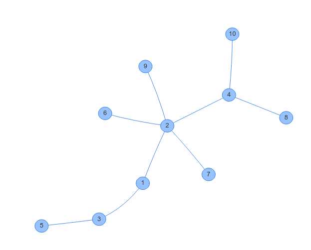

---  
date: "2019-08-19T17:44:24+09:00"  
title: "木の作り方"  
type: "post"  
draft: false  
---  
  
ABC138D Kiを本番で嘘解法で通してしまった(after_contestで気づいた)ので、ACコードと自分のコードにランダムにケースを入れてHackケースを探そう！と思いました。このとき、木のテストケースの作り方が分からなかったのでTwitterで教えてもらいました。以下、それらをまとめておきます。意見をくださった方、ありがとうございます。  
  
# 便利なツール  
グラフの可視化には[GRAPH×GRAPH](https://hello-world-494ec.firebaseapp.com/about.html) が便利です。  
  
# 木を順に構成する  
Python3で書きました。  
```  
import itertools, random  
N = 11  
R = 10  
l = list(range(1,N))  
h = list(itertools.permutations(l))  
seed = list(h[R])  
graph = []  
edge = []  
for i in seed:  
    if len(graph) != 0:  
        edge.append([i, graph[random.randrange(len(graph))]])  
    graph.append(i)  
print(edge)  
for i in edge:  
    print("{} {}".format(i[0], i[1]))  
```  
output  
```  
[[2, 1], [3, 1], [4, 2], [5, 3], [6, 2], [8, 4], [10, 4], [7, 2], [9, 2]]  
2 1  
3 1  
4 2  
5 3  
6 2  
8 4  
10 4  
7 2  
9 2  
```  
GRAPH×GRAPHでの結果  
  
木ができています！  
**# 原理**  
$1$から$N$までの順列からランダムにひとつとってきて`seed`とします。以下のように木を構成します。`graph`はその時点での木の頂点、`edge`は出力する辺の集合を表します。  
1.まず`seed[0]`を`graph`に加える  
2.`seed[i]`と、`graph`からひとつだけ任意に選んだ頂点`K`をつなぐ。具体的には、`edge`に`[seed[i], K]`を追加する。  
3.`seed[i]`を`graph`に加える。  
以降、`seed[i]`がとれなくなるまで手順2,3を繰り返す。  
手順2で連結かつ閉路が存在しないことが確認できるので、これは木になります。  
  
注意点としては、このコードでは`itertools.permutations`に時間がかかっているので、適当に順列を指定してあげればよいです。  
# UnionFindを使う  
これたぶん次の完全グラフを間引く方法と似ている気がします。(よく分からなかった)  
おそらくKruscalがUnionFindをつかうので、それと近い…？  
# 完全グラフを間引いて全域木を作る  
(後でやる)  
# Prufer Sequence  
https://en.wikipedia.org/wiki/Pr%C3%BCfer_sequence  
(後でやる)