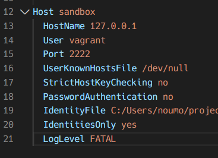

---  
date: "2019-12-20T12:04:56+09:00"  
title: "開発環境メモ: VSCodeでローカルの仮想環境にRemote SSH"  
type: "post"  
draft: false  
---  
  
この記事は [広島大学ITエンジニアアドベントカレンダー] の9日目です。  
私は大学にWindows機とLinux(Ubuntu)機の2台のlaptopを持っていっています。空きコマにさあコード書くぞ〜！と思ったときに開くのはいつもUbuntu。Linux機の方が貧弱なスペックなのですが、コード書くまでにかかる時間はWindowsよりLinuxの方が速いのです。(私はWindowsでは仮想環境でUbuntuを立ち上げてその中で開発するのでそれはそう)  
しかしWindowsでも快適に開発したい！というわけで、自分なりに快適だと思った環境をメモしておきます。
[Remote Development using SSH](https://code.visualstudio.com/docs/remote/ssh)を見ると詳しくちゃんとしたことが書いてあるので、こちらも参考にしてください。
  
# 目標  
- 仮想環境でSVGをwgetして、それをVSCodeからファイルクリックすると見れる！という環境を構築する(なぜこれが目標なのかというと、[@imiko](https://twitter.com/es__135) さんが仮想環境で生成したsvgを楽に見たいと言っていたので)  
  
# 環境  
以下の環境で確認しています。  
```  
Windows 10 Home  
Vagrant 2.2.6  
VirtualBox 6.0.14  
VSCode 1.41.0  
```  
- 仮想環境は`bento/ubuntu-18.04`を使用しています。
    
**ホストでインストールするもの**  
  
- VirtualBox  
- Vagrant  
- VSCode  

VSCodeで必要なExtension  
  
- Remote-SSH  
  
  
# 手順  
**Vagrantから仮想環境の立ち上げ**  
VSCodeを立ち上げます。  
  
`Open Code`でVagrantfileのあるフォルダを開き、`` Ctrl+` ``でVSCode内でターミナルを開き、Windowsのターミナルから`vagrant up`します。  
  
**SSH Configuration**  
はじめてのときはSSH接続するためにconfigを書いておく必要があります。  
  
`Ctrl+Shift+p`でcommand paletteを開き、`Remote-SSH: Open Configuration FIle...`を開きます。  
次に、Windowsのターミナルで`vagrant ssh-config`と打ち込みます(vagrant upした状態で、vagrantfileが存在するディレクトリで行ってください)  
以下のような内容が出てくると思います。それをRemote-SSHで開いたファイル`C:\Users\$UserName\.ssh\config`にコピペします。  
  
これでSSHの設定はできました。  
  
**SSHで仮想環境に接続する**  
以下の2点が達成できているでしょうか。  
- `vagrant up`している  
- SSH Config周りが設定できている  
それでは、SSH接続していきましょう。  
  
SSH接続できるアイコンがあるのでそれを押して、SSH TARGETSを選びます。今回はsandboxを選びました。  
  
sandboxを選択したときに出現する、右のアイコンをクリックしてください。VSCodeの新しいWindowがポップアップしたと思います。おそらく初めて接続した時ははRSA finger printについての警告が出てくると思うのですがYesでOKです。  
これで接続ができました。`` Ctrl + ` ``でターミナルに接続すると、仮想環境のターミナルになっていると思います。  
今回は`mkdir sandbox`して、Open Folderでは`sandbox`を選択しました。  
  
  
**SVGを表示する**  
今回はテストなので、wgetでSVGファイルを引っ張ってきましょう。[Testing SVG files in GitHub Gists](https://gist.github.com/AmeliaBR/193a8f36eb637af1684201821afd5f66)を利用しました。  
仮想環境上のターミナルで、以下を実行します。  
```bash  
wget https://gist.githubusercontent.com/AmeliaBR/193a8f36eb637af1684201821afd5f66/raw/2f695692701db7be18333926b41b7e9c15944d73/basic-marker.svg  
```  
`sandbox/`以下にファイルが保存されました。  
VSCodeのExtensionを入れます。[SVG Viewer](https://marketplace.visualstudio.com/items?itemName=cssho.vscode-svgviewer)を入れました。このとき、SSHで接続した仮想環境上で開いているVSCodeでインストールすることが重要です。 <!-- (どうやらHost環境とSSH接続した先ではExtensionの共有がされないようです) --> Extensionが`SSH:UBUNTU-Installed`のようになっていればSSH接続先でそのExtensionが使えます。詳しくは [Managing Extensions](https://code.visualstudio.com/docs/remote/ssh#_managing-extensions)を見てください。
これでファイルを開いてからsvg viewerの機能を使えばSVGが見れるようになりました。VSCodeのファイル上で右クリックしてSVG Viewerの機能を選択すればよいです。  

  
**終了時**  
終わる時はSSH接続を切って、`vagrant halt`を忘れずに。  
  
# Tips  
**ファイル管理はどうする？**  
Windowsでは共有フォルダを作ってやるとnpm installとかでうまくいかないことが多かったので、今は共有フォルダは作っているけどそこはほしいファイルを`mv ./hoge ../host_directory/`して移すために使っています。開発は共有フォルダではやらずに、gitで管理するという感じです。  
  
**ブラウザとかどうする？**  
vagrantfileで`config.vm.network`あたりを設定してあげるとそれほど困りません。  
あと、Nuxt.jsで開発しているとき`localhost:3000`で立ち上げてLinuxターミナルのリンクをクリックしたら自動でホスト側のリンクに変換されてchromeで開いたのですがこの機能はなんですか...  
  
**ホスト→仮想環境上にファイルを送りたい！**  
エクスプローラを開いてVSCodeのEXPLORERにドラッグアンドドロップでファイルを送信できます。なんだこの便利機能...  
  
# 終わりに  
以上です。便利なのでVSCodeを使いましょう！  
何か間違いや指摘などあれば、お手数ですがTwitter: [@kaito_tateyama](https://twitter.com/kaito_tateyama)までお願いします。  
  
<!-- link -->    
[広島大学ITエンジニアアドベントカレンダー]:https://adventar.org/calendars/4481