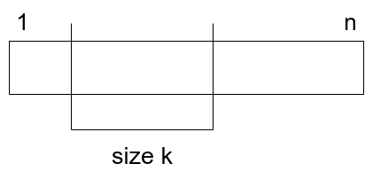

---  
date: "2020-01-12T06:44:01+09:00"  
title: "Codeforces Hello 2020 Writeup"  
type: "post"  
draft: false  
---  
  
C問題についてのみ書きます。  
  
# Hello 2020 C New Year and Permutation  
  
**問題**  
  
順列$p_1, p_2, ..., p_n$が与えられる。このとき、部分列$[l,r]$であって$max\(p_l,..,p_r\) - min\(p_l,..,p_r\) = r - l$が成り立つものをframed segmentと呼ぶことにする。すべての長さ$N$の順列に対して、framed segmentの数を数え上げてその和を素数$M$で割った値を求めよ。  
  
**解法**  
  
順列が与えられて、それに対するframed segmentの数を数えると$O\(N!\)$になってしまい計算量的に無理。そこで、**視点を変えて**サイズ$k$のframed segmentを横断的に数え上げる方法を考える。  
サイズ$k$のframed segmentの位置、内部で使われる数の集合(順番は無視する)を考える。  
  
  
  
図のように位置はスタート地点が$1$から$n-k+1$で全部で$n-k+1$通りある。  
また、内部で使われる数は、$r-l+1$個の相異なる数の最大値と最小値の差が$r-l$であることから、連続した$k$個の数なので、これもスライドして考えると$n-k+1$種類ある。  
  
次に、framed segment外部と内部の順列を考える。これは、内部で$k!$通り、外部で$\(n-k\)!$通りである。  
  
$1 \leq k \leq n$よりこれらを足し合わせて$m$で割れば答えが得られる。  
  
**実装**  
  
最後の足し合わせるところで$O\(N\)$であるので、$N \leq 250000$から各framed segmentのサイズごとは$O\(\log N\)$以下の計算量である必要がある。  
ここで、factorialは$f\(n\) = f\(n-1\) \times n$であることを考えると、これは配列と非常に相性がよく、前計算をしてその配列を使えばよいとわかる。  
  
```  
vector<i64> fact(n+1);  
fact[0] = 1;  
for(i64 i=1;i<=n;i++)fact[i] = fact[i-1]*i%m;  
for (k=1;k<=n;k++){  
    res += (サイズkのframed segmentの数)  
}  
```  
  
注意としては、サイズkのframed segmentの数を求める時のoverflowである。一つ掛けるごとにMODをとらなければ違う答えになってしまった。  
計算量は前計算$O\(N\)$, resに足し合わせて$O\(N\)$で全体で$O\(N\)$である。  
  
**コード**  
  
[https://codeforces.com/contest/1284/submission/68567949](https://codeforces.com/contest/1284/submission/68567949)  
  
**感想**  
  
はじめはMODが関わるライブラリゲーだと思ってmod_factorialなる関数を作ったが意味なかった。でもまた同じ思考になるかもしれないので、ライブラリのコメント欄に書いておいた。  
ModInt理解したい。  
