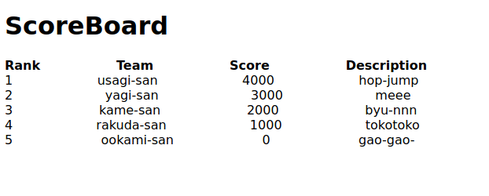

---  
date: "2020-05-03T23:42:39Z"  
title: "ICTSC 2019 一次予選 コンテナが作れない 復習"  
type: "post"  
draft: false  
---  
  
復習する問題は [コンテナがつくれない](https://blog.icttoracon.net/2019/08/27/ictsc2019-%e4%b8%80%e6%ac%a1%e4%ba%88%e9%81%b8-%e5%95%8f%e9%a1%8c%e8%a7%a3%e8%aa%ac-%e3%82%b3%e3%83%b3%e3%83%86%e3%83%8a%e3%81%8c%e4%bd%9c%e3%82%8c%e3%81%aa%e3%81%84/) です。  
  
# 目標  
本質的に、Dockerfileの修正が求められているので、以下のような問題を作りました。  
- 問題 https://github.com/uta8a/ictsc/tree/master/repo-2019-pre-1/container-1  
- Dockerfileを変更して、ホストPCから`http://192.168.33.10/index`にアクセスしてテーブルが以下のように表示されればOK  
  
  
  
# 環境  
- ブラウザ: Chrome - `nginx/index.html`でhtml templateを使っています  
- VirtualBox  
- Vagrant - Ubuntu18.04を動かして、その上でDockerなどを動かしています  
  
# 遊び方  
  
## ホストからUbuntu18.04環境に入る  
まず、`git clone https://github.com/uta8a/ictsc`で問題リポジトリを持ってきます。  
`ictsc/repo-2019-pre-1/container-1`で`vagrant up`, `vagrant ssh`でubuntu18.04環境に入る。以降はUbuntu18.04内でのコマンドになります。  
  
## setup  
以下のように権限を`install/`以下のシェルスクリプトに与えて実行し環境を作ります。ここは時間がかかるので気長に待ちましょう。  
```  
vagrant@vagrant $  
chmod +x ~/src/install/*.sh  
cd ~/src/install/  
sudo ./root.sh # update & install   
sudo ./install.docker.sh # docker install  
sudo ./install.docker-compose.sh # docker-compose install  
source ~/.bashrc  
```  
`docker`コマンドや`docker-compose`コマンドが動いたらOKです  
  
## dev: トラブルシューティングのやり方  
基本的にはdocker-composeコマンドを打つ -> 立ち上がらなければ原因を調べるという方針です。僕は以下のように、buildしてupしてexecでコンテナ内に入り調べました。  
想定解においては`backend/Dockerfile`のみを変更すればOKです。  
ref. docker-compose https://docs.docker.com/compose/  
  
```  
sudo docker-compose build  
sudo docker-compose up -d  
sudo docker-compose exec backend /bin/sh  
## down  
sudo docker-compose down  
```  
  
## check: 合っているかどうかの判定  
ホストPCからブラウザで`http://192.168.33.10/index`にアクセスしてテーブルが以下のように表示されればOK  
  
  
  
# 解説  
[公式解説](https://blog.icttoracon.net/2019/08/27/ictsc2019-%E4%B8%80%E6%AC%A1%E4%BA%88%E9%81%B8-%E5%95%8F%E9%A1%8C%E8%A7%A3%E8%AA%AC-%E3%82%B3%E3%83%B3%E3%83%86%E3%83%8A%E3%81%8C%E4%BD%9C%E3%82%8C%E3%81%AA%E3%81%84/) と重複するので、ここでは`Docker Multi-Stage Build`について詳しく書きます。  
  
## Multi-Stage Build  
`backend/Dockerfile`を見ると`FROM ...`が二つあることに違和感を覚えます。`FROM`について調べてみましょう。  
[FROM Instruction](https://docs.docker.com/engine/reference/builder/#from)  
  
> The FROM instruction initializes a new build stage and sets the Base Image for subsequent instructions. As such, a valid Dockerfile must start with a FROM instruction. The image can be any valid image – it is especially easy to start by pulling an image from the Public Repositories.  
  
Dockerfileは`FROM`からはじまる必要があるそうです。(正確には、`ARG`は`FROM`の前に出ることができます。)  
  
> FROM can appear multiple times within a single Dockerfile to create multiple images or use one build stage as a dependency for another. Simply make a note of the last image ID output by the commit before each new FROM instruction. Each FROM instruction clears any state created by previous instructions.  
  
`FROM`はひとつのDockerfileに何度も現れることができるようです。ステージができるたびに前回の`FROM`で作られた状態は消去されるようです。  
つまり、ここで2回`FROM`を使ってしまうと最初の状態が破棄されてしまうことになります。  
ここで、Docker Multi-Stage Buildを知っていると、この問題を解くことができます。  
[Docker Multi-Stage Build](https://docs.docker.com/develop/develop-images/multistage-build/)  
  
> How does it work? The second FROM instruction starts a new build stage with the alpine:latest image as its base. The COPY --from=0 line copies just the built artifact from the previous stage into this new stage. The Go SDK and any intermediate artifacts are left behind, and not saved in the final image.  
  
`FROM`を二度使ったときに、前回のステージでのファイルを次回のステージに引き継ぐことができます。このとき、最終的に生成されるイメージにはGo SDKのような前回のイメージで使われるものは含まれません。  
  
[Name your build stages](https://docs.docker.com/develop/develop-images/multistage-build/#name-your-build-stages) で、`AS`でステージに名前をつけることができると書かれています。(これは [`FROM`](https://docs.docker.com/engine/reference/builder/#from) でも書かれています)  
`busybox`での`--from=builder`より、前回のステージで`AS builder`とすればよいとわかります。  
  
## goの依存関係解消  
goのpackage管理は2020/05/04現在では`Go Modules`によるものが一般的だと思います。今回は`go.mod`を用意せず`go get`で入れています。  
基本は`import`にあるものを入れればよいです。  
  
## busybox  
busyboxでは`ash`なのでbashが使えません。コンテナに入ってデバッグするときには気をつけてください。`docker-compose exec`をしてコンテナ内でファイルの有無や権限の確認を行うとよいです。  
  
# その他のトラブルシューティング  
  
## circleci  
問題が解けているかCIでチェックするためにCircleCIを導入しました。このとき`git tag`で特定タグがついているときのみテストを走らせたかったのですがなかなかうまくいかず苦労しました。  
以下のようにworkflowsで制御することでうまくいきました。  
```  
workflows:  
  version: 2.1  
  chal-1:  
    jobs:  
      - container-1:  
          filters:  
            tags:  
              only:  
                - /v.*/  
            branches:  
              ignore:  
                - /.*/  
```  
どうやらtags onlyだけはCIが毎回走るらしく、branchesですべてignoreしておかないといけないようです。  
  
## exec-webapp.sh  
問題が公開されていないのでこのシェルスクリプトは何をしているのか分からず苦労しました。おそらくDBが立ち上がるのを待つのだと思うのですが、[Composeの起動順番の制御](https://docs.docker.com/compose/startup-order/)で紹介されている [wait-for-it](https://github.com/vishnubob/wait-for-it) はそのままではbusybox環境はashなため動作しません。  
悩んだ末にashに`nc`があることに気づき、以下のようにしました。  
```  
#!/bin/sh  
timeout 30 sh -c "until nc db 3306 ;do sleep 1; done" && /usr/local/bin/server  
```  
30秒待ってその間は`db`に対し`nc`で接続試行を繰り返します。もっとうまいやり方や、エラー処理の仕方がありそうなので教えてくださると嬉しいです。  
というか通常はDockerizeとか使っているんでしょうか？alpine環境でDB待ち結構厳しそうな気がするので、もしかしてDBは先に別で立ち上げておくものなのかな。  
  
## nginxとnetwork周り  
CORSを回避したくてnginxでリバースプロキシしようとしたのですが結局このあたりはまだ理解が浅いです。今は`localhost:8080/`は`index.html`を表示させて`localhost:8080/api/`で`backend`へ飛ばすようにしています。  
docker-composeでは`http://backend:8080/`のようにコンテナ名でアクセスできるのでかなりやりやすいですが、その分仕組みが見えずこのあたりのネットワークも詳しくなりたいです。  
  
# 反省  
  
こまかい反省です  
  
## webappの作りが雑  
- 実はScoreBoardといいながら点数順ソートを行っていません！(ごめんなさい！)  
  
## デバッグ用と本番用の分割  
- backend/Dockerfileにbashを入れているのはデバッグのとき楽にするためです。でもいらない気もします。  
  
# 解答 > chall  
`backend/Dockerfile`  
  
```  
FROM golang:alpine  
  
RUN apk -U add git  
RUN apk -U add bash  
  
ADD . /go/src/work  
WORKDIR /go/src/work  
  
RUN go build -tags netgo -o server main.go  
  
FROM busybox  
ENV GOPATH=/usr/local/bin/  
COPY --from=builder /go/src/work/exec-webapp.sh /usr/local/bin/  
ENTRYPOINT ["/usr/local/bin/exec-webapp.sh"]  
```  
  
# 解答 > src  
`backend/Dockerfile`  
  
```  
FROM golang:alpine AS builder  
  
RUN apk -U add git  
RUN apk -U add bash  
RUN go get -u github.com/gin-gonic/gin  
RUN go get -u github.com/go-sql-driver/mysql  
RUN go get -u github.com/jinzhu/gorm  
RUN go get -u github.com/gin-contrib/cors  
  
ADD . /go/src/work  
WORKDIR /go/src/work  
  
RUN go build -tags netgo -o server main.go  
  
FROM busybox  
ENV GOPATH=/usr/local/bin/  
COPY --from=builder /go/src/work /usr/local/bin/  
RUN chmod +x /usr/local/bin/exec-webapp.sh  
ENTRYPOINT ["/usr/local/bin/exec-webapp.sh"]  
```  
  
# 感想  
最近WebサービスをDockerを使ってホスティングすることが多くなってきました。開発者が開発に専念するという観点からは、AWSのFargateのようにホストが抽象化された状態でDockerの上に載るアプリだけに集中したいという欲求があるのだと思います。