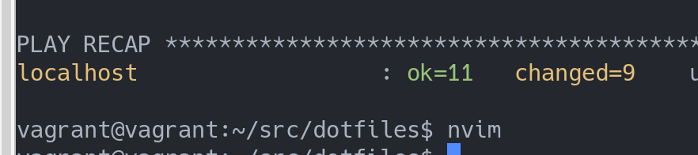
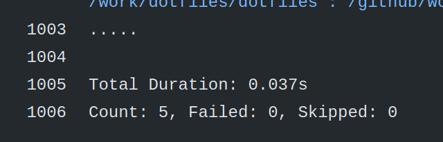

- この記事は [広島大学ITエンジニア Advent Calendar 2020](https://adventar.org/calendars/5209) の1日目です。新しいPCを買ってvimを入れてgitを入れて...とか、VirtualBoxで新しくVM立ち上げて設定して...と何度も同じことをしていると自動化したくなります。テストを含めてやってしまいましょう！
- [使用技術、キーワード] ansible, goss, Docker, dotfiles, GitHub Actions
- なにか間違いや感想ありましたら [Twitter: @kaito_tateyama](https://twitter.com/kaito_tateyama) か [マシュマロ](https://marshmallow-qa.com/kaito_tateyama) にお願いします。

## # 目次
- まず、**目標**、**環境**、**概要**、**やってみる** でざっくりとPCの初期セットアップする流れを見ていきます。
- 後半は、**用語説明**、**ディレクトリ構成の説明**、**ansibleについて**、**gossについて**、**GitHub Actionsについて**を通して、セットアップのために使うツールとしてansible、セットアップの事前に行うテストツールとしてgossとGitHub Actionsを説明します。
- そして**その他**で細かい話やなぜansibleなのかを述べます。

## # 目標
- neovimを新PCに入れる作業を自動化する。そのとき、スクリプトがちゃんと動くことを保証するためにGitHub ActionsでCIを回してテストを行う。

## # 環境
- 使用するコードは [https://github.com/uta8a/dotfiles](https://github.com/uta8a/dotfiles) で公開しています。
- 以下の環境で確認しています。(2020/11/30現在)
```text
OS: Ubuntu20.04
ansible: 2.9.6
goss: v0.3.15
Docker: version 19.03.8, build afacb8b7f0
docker-compose: version 1.25.0, build unknown
```

## # 概要
- 以下のような手順でPCの初期セットアップをしていきます。
```text
1. PCを買う
    - OSを入れる。(Ubuntu 20.04)
    - credential(SSH keysなど)をダウンロード(USBやクラウド(private storage)経由)
2. https://github.com/uta8a/dotfiles にアクセス
    - install.ubuntu-20.sh の中身をコピー
    - 手元でinstall.ubuntu-20.shにそれを書き込み、chmod +xしてから実行 # ここでansibleとgitが入る
3. git clone https://github.com/uta8a/dotfiles して手元にリポジトリを持ってくる
    - cd dotfiles
    - ansible-playbook main.yml -K # ansibleを実行してセットアップ
```
- 期待される結果として、neovimが使える(nvimコマンドが使える)ようになっていればOKです。
- **注意** gitconfigなど、私個人に依存する情報が入っているので、cloneして試すときは後半の仕組みやディレクトリの構造を理解して必要な箇所を変更して行ってください。

## # やってみる
- 今回は新しいPCを用意できなかったのでVM(VirtualBox+Vagrant)で行いました。使用したのは ``bento/ubuntu-20.04`` です。
```text
19:29 $ ./install.ubuntu-20.sh
19:32 $ ansible-playbook main.yml -K # password入力を求められる
19:37 $ nvim # 使えた！
```
- installする量にもよりますが、今回はだいたい10分弱くらいセットアップにかかるようです。
- neovimを使うことができるようになりました。やったね！



## # 用語説明
- ansible: [repository](https://github.com/ansible/ansible) / [documents](https://docs.ansible.com/ansible/latest/index.html) / サーバのコマンドラインでやれる設定をコード化できる自動化ツール。複数回実行したときに、サーバの状態が変わらない冪等性(idempotency)が特徴。
- goss: [repository](https://github.com/aelsabbahy/goss) / [documents](https://github.com/aelsabbahy/goss/blob/master/docs/manual.md) / サーバの状態をyamlで指定して、その状態になっているかテストすることができる。
- Docker: [repository](https://github.com/docker) / [documents](https://docs.docker.com/reference/) / 仮想化された環境、コンテナを扱う技術。

## # ディレクトリ構成の説明
```text
.
├── action.yml 
├── docker-compose.yml
├── Dockerfile
├── entrypoint.sh
├── goss.yaml
├── install.sh 
├── install.ubuntu-20.sh
├── ISSUE.md
├── LICENSE
├── main.yml
├── os
│   └── ubuntu-20.yml
├── README.md
└── roles
    ├── cfg
    │   ├── files
    │   ├── README.md
    │   ├── tasks
    │   │   └── main.yml
    │   ├── tests
    │   │   └── goss.yaml
    │   └── vars
    │       └── main.yml
    └── neovim
        ├── files
        ├── README.md
        ├── tasks
        │   └── main.yml
        ├── tests
        │   └── goss.yaml
        └── vars
            └── main.yml
```
- ひとつひとつ説明していく

|ファイル名|説明|
|:--|:--|
|action.yml | GitHub Actionsで使う|
|docker-compose.yml | ローカルでgoss validateを回すときに使う|
|Dockerfile | ローカルとGitHub Actionsで使用|
|entrypoint.sh | GitHub Actionsで、Dockerfileとセットで使う|
|.github | GitHub Actions workflow|
|goss.yaml | gossで指定するyaml。roles/**/tests/goss.yamlをまとめたもの|
|install.sh | (deprecatedなので後で消す)|
|install.ubuntu-20.sh | PCで一番最初に行う。この段階ではgitも使えない状態なのでGitHub(web)からコピーして使う|
|ISSUE.md | (for development, メモ)|
|LICENSE | MIT license|
|main.yml | ansible-playbookで指定する。ここでOSの判別を行う。|
|os/ | Ubuntu20.04, 将来的にはmacOSなど、OS別にplaybookを定義したい。|
|README.md | 説明書|
|roles/ | ansibleのroles.(次の章で詳しく説明する)|

## # ansibleについて
```text
roles/cfg/
├── files
├── README.md
├── tasks
│   └── main.yml
├── tests
│   └── goss.yaml
└── vars
    └── main.yml
```

- ``ansible-playbook`` を実行したとき、まず指定したyaml( ``main.yml`` )を見に行って、次にその中で指定されたyaml( ``os/ubuntu-20.yml`` )を見に行きます。 [``os/ubuntu-20.yml``](https://github.com/uta8a/dotfiles/blob/683a89ccffc6bbf439eadefaa08e1f9faf9c05ad/os/ubuntu-20.yml) を見てみましょう。

```yaml
- name: Update apt
  ...
- name: Setup config
  import_role:
    name: cfg
- name: Install neovim & neovim settings
  ...
```

- 一部省略していますが、 ``import_role`` で ``cfg`` という名前のroleを見に行っていることがわかります。
- では [``roles/cfg``](https://github.com/uta8a/dotfiles/tree/683a89ccffc6bbf439eadefaa08e1f9faf9c05ad/roles/cfg) を見てみましょう。

```yaml
# tasks/main.yml
- name: Install pkgs via apt
  apt:
    pkg:
      - cmake
      ...
  become: yes
- name: Add git configuration
  git_config:
    ...
- name: Create .cache
  file:
    ...
```

- ``become: yes`` などはansibleのdocumentsを見れば分かるので省略します。
- ここでようやく終着点で、 ``apt install`` など、必要なパッケージをインストールしたり、fileを配置したりします。これらの作業単位を ``task`` と呼びます。そのtaskをまとめたものが ``role`` になります。
- ここまでで、ansibleがroleを見に行ってtaskを実行し、サーバやPCにパッケージをインストールするなどの設定を行っていることが分かりました。

## # gossについて
- ここまでで、ansibleの動きは分かりました。
- では、それらをテストするにはどうしたらよいでしょうか？実機で実際にansibleを流す前に、Dockerのような仮想的な環境を用いてテストを行いましょう！
- ここではgossというツールを使います。(ansible moleculeという選択肢も検討しましたがこちらを選びました。理由はその他で後述)
- gossは以下のようにバイナリをとってきて設定ファイル( ``goss.yaml`` )を指定すればよいです。

```shell
$ goss -g ./goss.yaml validate
```

- ``goss.yaml`` を見ていくと、以下のようになっています。

```yaml
gossfile:
  roles/cfg/tests/goss.yaml: {}
  roles/neovim/tests/goss.yaml: {}
```

- ここでは複数のgossの設定ファイルをまとめています。cfgの方を見てみましょう。

```yaml
package:
  vim:
    title: Installed check vim
    installed: true
  git:
    title: Installed check git
    installed: true
file:
  ~/.gitconfig:
    title: File check gitconfig
    exists: true
    contains:
      - "name = uta8a"
```

- ここが具体的にテストを行っているところです。状態を記述していますね。
- 以上で、gossと設定ファイルについて述べてきました。

## # GitHub Actionsについて
- ここまでで、ansibleで設定をする→gossでその状態になっているかテストする流れが分かりました。
- では、これらをDocker上で行い、 ``goss validate`` の結果を見てみましょう。
- ``.github/workflows/main.yml``

```yaml
name: Test dotfiles on GitHub Actions
on: [push]
jobs:
  skipci:
    runs-on: ubuntu-latest
    steps:
      - run: echo "[skip ci] ${{ contains(github.event.head_commit.message, '[skip ci]') }}"
  test_ubuntu_20:
    name: Test for Ubuntu 20.04
    runs-on: ubuntu-latest
    if: contains(github.event.head_commit.message, '[skip ci]') == false
    steps:
      - name: Checkout the repository
        uses: actions/checkout@v2
      - name: Build docker
        uses: ./
        id: dotfiles
      - name: Message
        run: echo "See Build docker goss output"
```

- skipciで、コミットメッセージに ``[skip ci]`` が含まれていた場合に後続の ``test_ubuntu_20`` を行わずskipします。
- ``uses`` で ``./`` を指定するとその場所のDockerfileをビルドします。このとき、Dockerfileのentrypoint.shで ``goss validate`` しているので、テストが失敗すればExit Statusが0以外になってGitHub ActionsもFailします。
- 以上で、GitHub ActionsでpushしたらCIを回して、ansibleを流してgossでテストするDockerをたてることでテストできることが分かりました。
- 下はGitHub Actionsでgoss validateが動いている様子です。(5つのテストがpassしている)



## その他
## # なぜ個人環境構築にansibleを選んだのか？
- 冪等性があるからです。
- 例えば、shell scriptを使うとファイルのダウンロードなど、2度スクリプトを流したときに困る場面がでてきます。解決するためにshell scriptをたくさん書いて条件分岐するより、ansibleを使ったほうがよいと判断しました。

## # aptで大量に入れると時間がかかる
- setup時にaptで大量に入れると結構時間かかります。これはGitHub Actionsでも効いてくるので、時間がかかって不安な場合はverbose出したほうがいいかもしれない。(``-v, -vv, -vvv``)
```shell
$ ansible-playbook main.yml -K
BECOME password:
[WARNING]: provided hosts list is empty, only localhost is available. Note that the
implicit localhost does not match 'all'

PLAY [Setup environments] **************************************************************

TASK [Gathering Facts] *****************************************************************
ok: [localhost]

TASK [Update apt] **********************************************************************
ok: [localhost]

TASK [cfg : Install pkgs via apt] ****************************************************** # ここでめっちゃ時間かかる
changed: [localhost]

TASK [cfg : Add git configuration] *****************************************************
-- snipped --

TASK [cfg : Create .cache] *************************************************************
changed: [localhost]

TASK [neovim : Install pre requirements] ***********************************************
changed: [localhost]

TASK [neovim : Add repository for nvim] ************************************************
changed: [localhost]

TASK [neovim : Install nvim] ***********************************************************
changed: [localhost]

TASK [neovim : Fetch dein.vim] *********************************************************
changed: [localhost]

TASK [neovim : Install dein.vim] *******************************************************
changed: [localhost]

TASK [neovim : Clean up installer] *****************************************************
changed: [localhost]

PLAY RECAP *****************************************************************************
localhost                  : ok=11   changed=9    unreachable=0    failed=0    skipped=0    rescued=0    ignored=0
```

## # GitHub Actionsで自分のDockerfileを使う
- action.yml, Dockerfile, entrypoint.shが必要で、それらをworkflowsから指定すると自前のDockerが組めるという認識をしています。ただあまり深く分かってないです...
## # moleculeをあきらめてgossを採用した理由
- moleculeはrootでの動きが想定されている気がします。driver dockerで``sudo docker``したいと思ったときに、sudoなしdockerにしなければいけない雰囲気があり、回避策が見つけられず断念しました。(個人的にsudoなしdockerコマンドを使いたくなかったという理由です)
- また、moleculeでテストするとなると、最初にdockerとmoleculeを入れるためのansibleを書く必要があり、ansibleが2段階になり複雑化しそうでした。gossはバイナリを取ってくるだけでよいので、ansibleの設定ファイルをすっきりさせることができました。
- 最後に、gossは定期的に回せるスクリプトである点が良いと思いました。ansible moleculeはあくまでansibleに対するテストですが、gossは使い方によって定期的にPCの状態を確認する方にも使えます。これは例えば``.bashrc``などに変更があったとき、ローカルPCでgossを回してそれに気づき、dotfilesを更新するといった使い方もできそうです。
## 終わりに
- まとめ
- ⭐ ansibleはyamlをたどっていくと、具体的には ``roles/**/tasks/main.yml`` の中に書いてある処理を行っている。
- ⭐ gossは設定ファイルのyamlに状態を記述してテストする。
- ⭐ GitHub ActionsでCI testを回すとき、ci skipなども使える(docuementのみの更新はskip ciする)